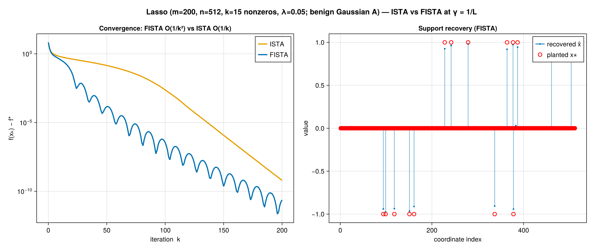

# DESIGN — a five-minute tour

This is the short read. For the full maintainer reference see the
[architecture docs site](https://MoFirouzT.github.io/Iterative-Methods-Test-Engine)
(one page per module); for the one-command demo see [README.md](README.md).

## The problem it solves

When you are developing an iterative optimization method, the questions that actually
matter are comparative: *Does my variant beat the baselines? On which problems? How does
it scale with dimension and conditioning? Is it actually faster, or just doing less
bookkeeping?* Answering these by hand means re-plumbing a run loop, a logger, a timing
harness, and a plotting pipeline for every experiment — and the comparisons drift apart.

This engine makes the comparison the unit of work. You define a method once; the harness
runs it (and its swept variants, and the conventional baselines) on shared problems under
identical stopping criteria, records convergence and *core* compute time the same way for
every method, and hands back a serializable result you can plot or reload. The guiding
rule is **demonstrate, don't advertise**: every capability the framework claims has
exactly one clean, working consumer you can watch run — not an exported abstraction taken
on faith.

## Six design principles

1. **Multiple dispatch over hierarchies.** Methods, components (step size, descent
   direction, extrapolation, preconditioner), stopping criteria, problems, and Hessian
   representations are all dispatch points. A new variant is a new type + a method on the
   relevant function — never an edit to existing code.

2. **Engine / content separation.** `src/` (the `TestEngine` module) ships only
   abstractions and machinery: the `Problem`/`Objective`/`Hessian` interfaces, the
   `run_method` loop, stopping criteria, the variant-grid engine, logging, persistence,
   plotting. Every *concrete* method, problem, and component is **content** under
   `algorithms/` and `problems/` that extends the engine via `import .TestEngine`. The
   engine never names a concrete method — so it stays small and dependency-lean.

3. **Scientific measurement discipline.** A step wraps its real mathematics in
   `@core_timed`; logging, stopping-criterion checks, and verbosity are deliberately
   excluded from measured time. This makes "is it faster?" answerable honestly: on 2-D
   Rosenbrock the kernel is below the timing floor, but on `n = 1000` least squares the
   `O(mn)` matvec dominates and `core_time/wall_time` climbs to ~98% — the ratio itself is
   a reported result, not an afterthought.

4. **Declarative, reproducible experiments.** An experiment is a plain `ExperimentConfig`
   value. Running it, saving it, and reloading it are independent operations, and every
   source of randomness (data, warm-up, `x0`, stochastic steps, sub-solvers) derives from a
   single seed by deterministic hashing.

5. **Specification-driven.** Every problem and method ships a co-located `.md` spec that is
   the single source of truth for the math, the implementation contract (`init_state`,
   `step!`, `extract_log_entry`), and the win conditions its demonstrating experiment must
   show (a symbol→code variable-mapping table is optional, used only where the mapping
   isn't obvious from the code).

6. **Separation of concerns across modules.** Algorithms know nothing about logging,
   loggers nothing about plotting, stopping criteria nothing about algorithms. Each module
   talks to the next through plain data structures, so any one can be read, tested, and
   replaced in isolation.

## One experiment, annotated: ISTA → FISTA on the lasso

The flagship experiment ([experiments/exp_lasso_ista_fista.jl](experiments/exp_lasso_ista_fista.jl))
exercises the whole composite-objective path with a single method.

**Problem.** Sparse recovery: `min_x ½‖Ax − b‖² + λ‖x‖₁`, underdetermined (`m < n`) with a
planted `k`-sparse signal — registered as the `:lasso` family.

**Method.** `ProximalGradient` is one method with two plug-in slots: a `StepSize` and a
`Extrapolation`. Each step extrapolates, takes a gradient step on the smooth `½‖Ax−b‖²`, then
applies the `prox` of `λ‖x‖₁` (soft-thresholding):

- `Extrapolation = NoExtrapolation()` ⇒ **ISTA** (plain proximal gradient, `O(1/k)`).
- `Extrapolation = NesterovStep()` ⇒ **FISTA** (`O(1/k²)`).
- a *zero* regularizer ⇒ the same method is (accelerated) gradient descent on a smooth
  problem — so one method also tells the smooth-acceleration story.

**Result (the flagship figure).**

*Left:* `f(xₖ) − f*` on a log axis. FISTA's curve plunges below ISTA's and stays ~3–4 orders
of magnitude lower through the interesting regime — the textbook `O(1/k²)` vs `O(1/k)` gap,
with FISTA's characteristic non-monotone ripple. *Right:* the recovered iterate's nonzeros
coincide with the planted ±1 support, against a flat zero baseline.

**Why it's trustworthy.** The regularizer's `prox` is provided by
[ProximalOperators.jl](https://github.com/JuliaFirstOrder/ProximalOperators.jl) behind the
engine's `prox` contract, and the converged solution is cross-checked against
[ProximalAlgorithms.jl](https://github.com/JuliaFirstOrder/ProximalAlgorithms.jl)'s
ForwardBackward/FastForwardBackward (`test/test_external_validation.jl`). The same harness
also surfaced — and fixed — two latent bugs that 2-D Rosenbrock never triggered: a Cauchy
step-size curvature guard that misfired as `‖∇f‖→0`, and a missing-import break in
`diagonal(::MatrixHessian)`. A capability is only demonstrated by watching it run.

## Where to go next

- Run it: `julia --project scripts/reproduce.jl` (see [README.md](README.md)).
- The other four figures (dimension scaling + timing pillar, conditioning sweep, Jacobi
  preconditioning ≈ Newton, and trust-region + Steihaug-CG nested optimization) are in
  `figures/` and `experiments/exp_*.jl`.
- Full internals: the [architecture docs site](https://MoFirouzT.github.io/Iterative-Methods-Test-Engine).
