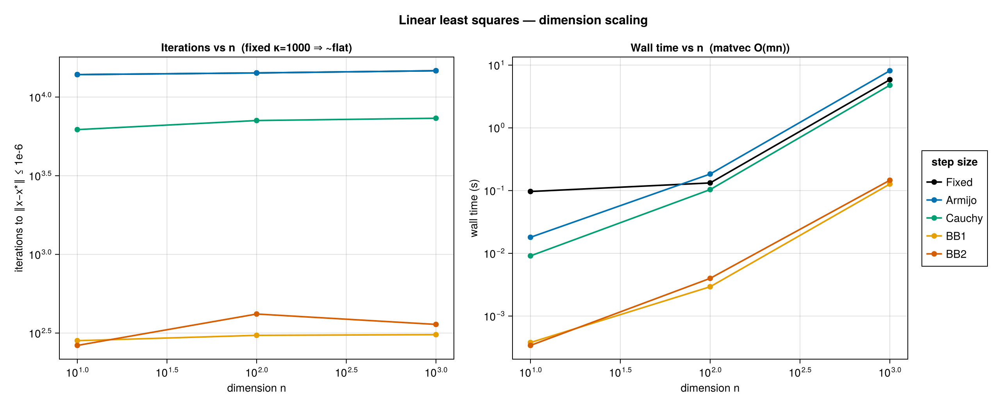
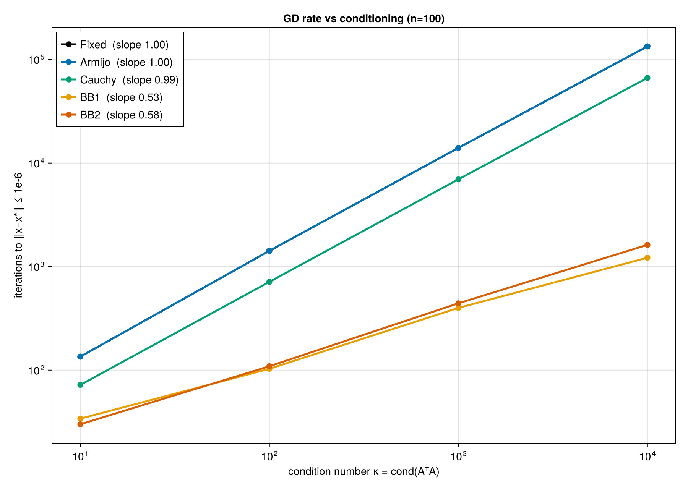
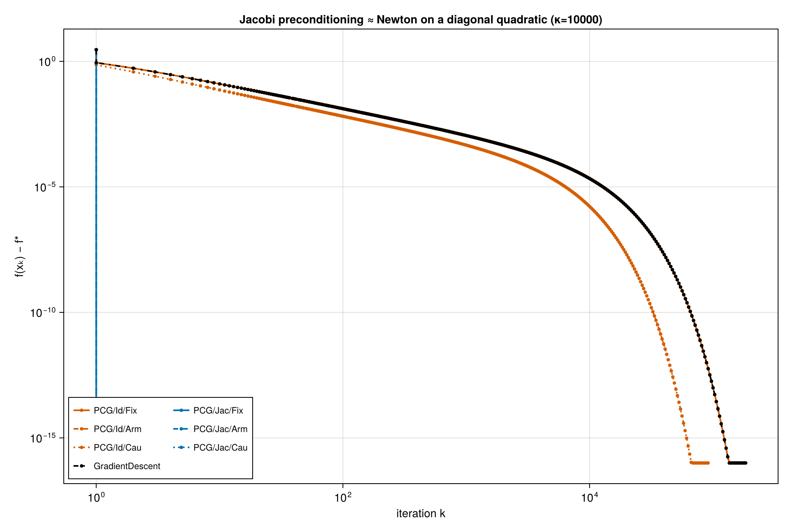
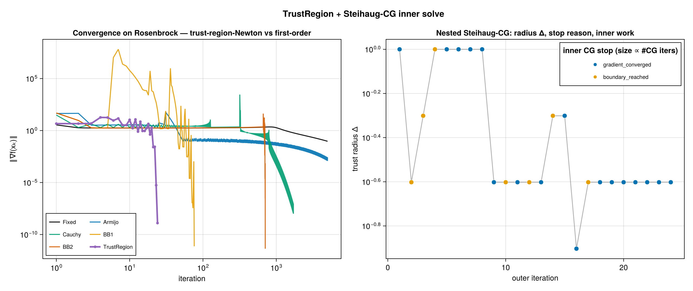

# Experiments

Runnable scripts that drive the engine end-to-end. Two tracks live here:

- **Portfolio experiments** (`exp_<problem>.jl`) — the curated demonstrators,
  named after their problem (the two least-squares experiments are `ls1`/`ls2`).
  They produce the five figures in [`figures/`](../figures/), catalogued with what
  each one demonstrates below. One clean experiment per capability — the headline
  deliverables.
- **[Development stages](stages/)** (`stages/stageN.jl`) — a capability-by-capability
  validation of the engine, built in dependency order on a single 2D Rosenbrock
  problem: each stage drives one architectural block and asserts its contract
  before the next stage depends on it. Stage 0 runs in CI. These are the
  integration checks behind the portfolio figures, not figures themselves — see
  [stages/README.md](stages/README.md).

`_bootstrap.jl` loads the engine + all content in dependency order; `_shared.jl`
holds shared plotting recipes. Both are includes, not runnable scripts.

## Portfolio experiments

Each capability has exactly one clean, working demonstrator you can watch run — no
method zoo. The five shipped experiments:

| Script | Figure | Demonstrates |
| --- | --- | --- |
| [`exp_lasso_ista_fista.jl`](exp_lasso_ista_fista.jl) | `lasso_ista_fista.png` (flagship) | One `ProximalGradient`, **extrapolation component swept** (ISTA → heavy-ball → FISTA); composite `f + g`, `prox` dispatch, Nesterov acceleration on the lasso |
| [`exp_ls1_dimension.jl`](exp_ls1_dimension.jl) | `ls1_dimension.png` | Least-squares dimension sweep; matrix-free `OperatorHessian`; the core-time/wall-time timing pillar |
| [`exp_ls2_conditioning.jl`](exp_ls2_conditioning.jl) | `ls2_conditioning.png` | Conditioning controls the rate: `O(κ)` vs `O(√κ)` |
| [`exp_precond_grid.jl`](exp_precond_grid.jl) | `precond_grid.png` | `VariantGrid` sweep + role-based baseline/experimental routing; Jacobi preconditioning ≈ Newton |
| [`exp_tr_steihaug_cg.jl`](exp_tr_steihaug_cg.jl) | `tr_steihaug_cg.png` | Nested optimization: `TrustRegion` with a Steihaug-CG inner solve |

Run any one with `julia --project=. experiments/exp_<name>.jl`, or regenerate
every figure at once with [`reproduce.jl`](../reproduce.jl).

Correctness is **externally cross-checked**: converged solutions are matched against
`A\b`, [`Optim.jl`](https://github.com/JuliaNLSolvers/Optim.jl) (GradientDescent / LBFGS),
and [`ProximalAlgorithms.jl`](https://github.com/JuliaFirstOrder/ProximalAlgorithms.jl)
(ForwardBackward / FastForwardBackward) — see [`test/test_external_validation.jl`](../test/test_external_validation.jl).

### Figures

 
*`lasso_ista_fista` (flagship) — one `ProximalGradient` with the extrapolation component swept: ISTA → heavy-ball → FISTA orders the convergence, plus exact support recovery.*

 
*`ls1_dimension` — dimension sweep; matrix-free `OperatorHessian`; the core-time/wall-time timing pillar.*

 
*`ls2_conditioning` — conditioning controls the rate: `O(κ)` vs `O(√κ)`.*

 
*`precond_grid` — `VariantGrid` sweep + role-based baseline/experimental routing; Jacobi preconditioning ≈ Newton.*

 
*`tr_steihaug_cg` — nested optimization: `TrustRegion` with a Steihaug-CG inner solve.*

## Planned — not yet built

Deliberate scope boundary, listed so the extension points don't get lost. Each
is blocked on the noted work, not on the engine design.

- **SGD / logistic regression** — exercises the stochastic `step!` rng path
  *functionally* (per-`(seed, run_id)` row sampling, seed-variance IQR bands).
  Needs an SGD-flavored method + a logistic problem with mini-batches.
- **Constrained / projection problems** — an indicator-function regularizer
  (`prox` = projection) + a projected-gradient method on a box-constrained
  quadratic; a different `prox` shape from the lasso.
- **File-loaded problem** — exercise `FileProblem` / `register_file_loader!` in
  the live experiment path (unit-tested in `test/test_module9.jl`, no experiment).
- **`numerical_gradient` on an anisotropic problem** — central-difference
  correctness beyond smooth Rosenbrock, to catch step-selection bugs.
- **BB nonmonotone (GLL) safeguard** — the real fix for BB's clamp limitation
  (analysis in [`step_sizes.md §5.2`](../algorithms/components/step_sizes.md)).
- **Smaller swept variants** — a `MomentumStep` (heavy-ball) figure, a lasso
  sparsity-vs-λ sweep, and an `L2Norm` ridge demo are all cheap one-offs.
