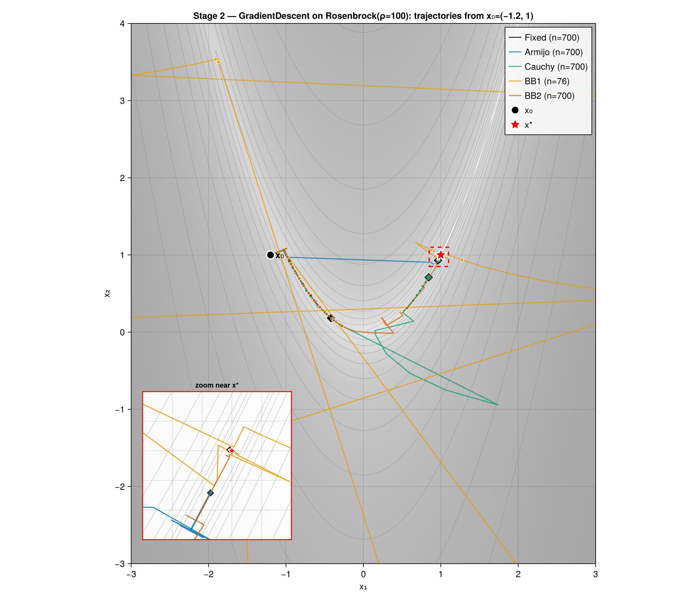

# Development Stages — the Rosenbrock build log

*Stage 2: five step-size rules (Fixed, Armijo, Cauchy, BB1, BB2) navigating the
banana valley from x₀ = (−1.2, 1). Regenerate with `julia --project=. experiments/stages/stage2.jl`.*

The engine wasn't built all at once. It grew capability-by-capability across nine
stages on a single 2D Rosenbrock problem (ρ = 100, x₀ = (−1.2, 1) unless noted) —
each stage validating one architectural block before the next depends on it. This
directory is that build log; it is **development scaffold, not a portfolio result**.

The curated, problem-named experiments that produce the figures in the top-level
README live one level up (`experiments/exp_<problem>N.jl`) and are the project's
headline deliverables. These stages are the rehearsal behind them.

> The build-up is intentional. Stages 0–4 hand-roll the per-method RNG derivation
> and run loop, rehearsing the orchestrator's contract before depending on it.
> Stage 5 is the orchestrator's debut; Stages 6–8 build on it. After Stage 7,
> every block that *can* be validated on Rosenbrock has been; the rest require
> other problem types (see the [planned-work list](../README.md#planned--not-yet-built)).

## The stages

| # | Stage | File | What it validates |
|---|-------|------|-------------------|
| 0 | Smoke test | [`smoke_test.jl`](smoke_test.jl) | Runner contract end-to-end; objective monotone + decreasing (asserted — runs in CI) |
| 1 | Convergence panels | [`stage1.jl`](stage1.jl) | Five GD variants on Rosenbrock; 2×2 panel of f, ‖∇f‖, ‖x−x*‖, αₖ |
| 2 | Trajectories | [`stage2.jl`](stage2.jl) | `extras` → DataFrame plumbing (`:x_iter`); the contour-map trajectory recipe (figure above) |
| 3 | Persistence roundtrip | [`stage3.jl`](stage3.jl) | `save_experiment` → `load_experiment` → byte-identical CSV across a fresh process |
| 4 | Stopping criteria | [`stage4.jl`](stage4.jl) | `CompositeCriteria`, `DistanceToOptimal`, runner-side `dist_to_opt`, `stop_reason` coverage |
| 5 | Orchestrator debut | [`stage5.jl`](stage5.jl) | `run_experiment` + `VariantGrid` + fair-comparison plots (vs iters / evals / core-time) |
| 6 | Multi-run + warm-up | [`stage6.jl`](stage6.jl) | Randomized x₀, `n_runs` aggregation, IQR bands, warm-up vs cold timing |
| 7 | Observability | [`stage7.jl`](stage7.jl) | Debug mode, extended stopping criteria, range-gated verbosity |
| 8 | Cross-cutting | [`stage8.jl`](stage8.jl) | `logger.events` roundtrip, `aggregate_runs(:all)`, `method_color` registry, `run_sub_method` shape |

Each stage file's header comment carries the full `Exercises:` / `Validates:`
breakdown — kept next to the code it checks so it can't drift from this table.
Blocks that Rosenbrock structurally can't reach are listed under
[planned work](../README.md#planned--not-yet-built).
